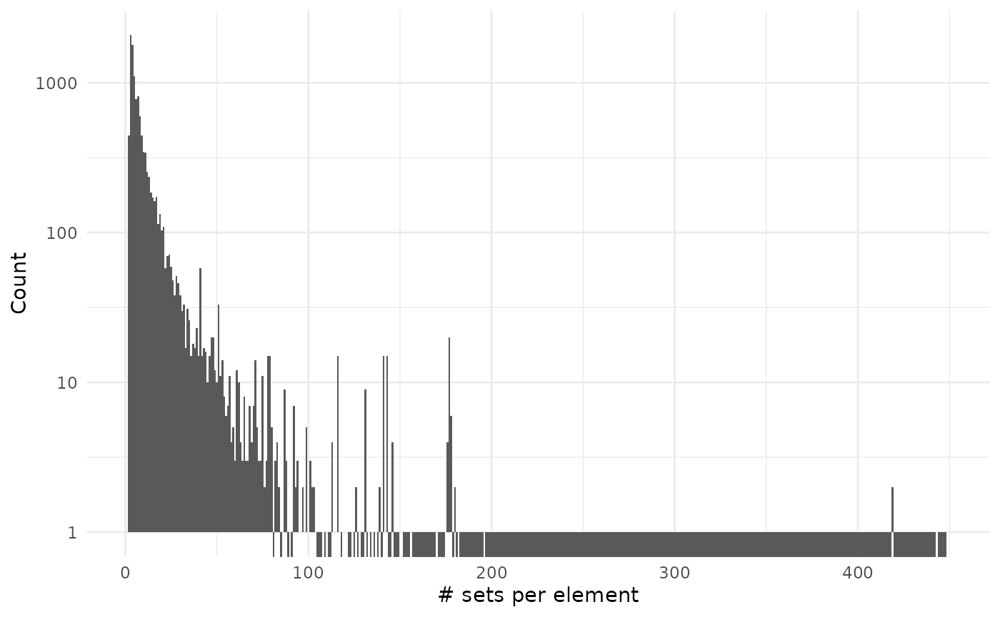
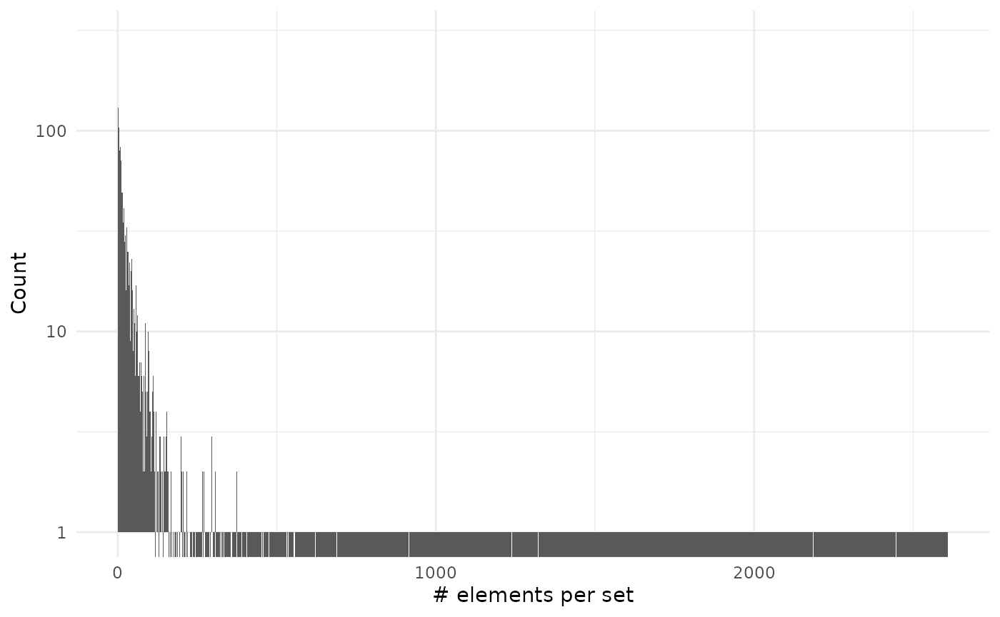

# Advanced examples

Abstract

This vignette assumes you are familiar with set operations from the
basic vignette.

## Initial setup

To show compatibility with tidy workflows we will use magrittr pipe
operator and the dplyr verbs.

``` r

library("BaseSet", quietly = TRUE)
library("dplyr", quietly = TRUE)
```

## Human gene ontology

We will explore the genes with assigned gene ontology terms. These terms
describe what is the process and role of the genes. The links are
annotated with different [evidence
codes](https://geneontology.org/docs/guide-go-evidence-codes/) to
indicate how such annotation is supported.

``` r

# We load some libraries
library("org.Hs.eg.db", quietly = TRUE)
#> Warning: package 'AnnotationDbi' was built under R version 4.6.1
#> Warning: package 'BiocGenerics' was built under R version 4.6.1
library("GO.db", quietly = TRUE)
library("ggplot2", quietly = TRUE)
# Prepare the data 
h2GO_TS <- tidySet(org.Hs.egGO)
h2GO <- as.data.frame(org.Hs.egGO)
```

We can now explore if there are differences in evidence usage for each
ontology in gene ontology:

``` r

library("forcats", include.only = "fct_reorder2", quietly = TRUE)
h2GO %>% 
    group_by(Evidence, Ontology) %>% 
    count(name = "Freq") %>% 
    ungroup() %>% 
    mutate(Evidence = fct_reorder2(Evidence, Ontology, -Freq),
           Ontology = case_match(Ontology,
                                 "CC" ~ "Cellular Component",
                                 "MF" ~ "Molecular Function",
                                 "BP" ~ "Biological Process",
                                 .default = NA)) %>% 
    ggplot() +
    geom_col(aes(Evidence, Freq)) +
    facet_grid(~Ontology) + 
    theme_minimal() +
    coord_flip() +
    labs(x = element_blank(), y = element_blank(),
         title = "Evidence codes for each ontology")
#> Warning: There was 1 warning in `mutate()`.
#> ℹ In argument: `Ontology = case_match(...)`.
#> Caused by warning:
#> ! `case_match()` was deprecated in dplyr 1.2.0.
#> ℹ Please use `recode_values()` instead.
#> Warning: `label` cannot be a <ggplot2::element_blank> object.
#> `label` cannot be a <ggplot2::element_blank> object.
```


We can see that biological process are more likely to be defined by IMP
evidence code that means inferred from mutant phenotype. While inferred
from physical interaction (IPI) is almost exclusively used to assign
molecular functions.

This graph doesn’t consider that some relationships are better annotated
than other:

``` r

h2GO_TS %>% 
    relations() %>% 
    group_by(elements, sets) %>% 
    count(sort = TRUE, name = "Annotations") %>% 
    ungroup() %>% 
    count(Annotations, sort = TRUE) %>% 
    ggplot() +
    geom_col(aes(Annotations, n)) +
    theme_minimal() +
    labs(x = "Evidence codes", y = "Annotations", 
         title = "Evidence codes for each annotation",
         subtitle = "in human") +
    scale_x_continuous(breaks = 1:7)
```


We can see that mostly all the annotations are done with a single
evidence code. So far we have explored the code that it is related to a
gene but how many genes don’t have any annotation?

``` r

# Add all the genes and GO terms
h2GO_TS <- add_elements(h2GO_TS, keys(org.Hs.eg.db)) %>% 
    add_sets(grep("^GO:", keys(GO.db), value = TRUE))

sizes_element <- element_size(h2GO_TS) %>% 
    arrange(desc(size))
sum(sizes_element$size == 0)
#> [1] 172971
sum(sizes_element$size != 0)
#> [1] 20826

sizes_set <- set_size(h2GO_TS) %>% 
    arrange(desc(size))
sum(sizes_set$size == 0)
#> [1] 20837
sum(sizes_set$size != 0)
#> [1] 17902
```

So we can see that both there are more genes without annotation and more
gene ontology terms without a (direct) gene annotated.

``` r

sizes_element %>% 
    filter(size != 0) %>% 
    ggplot() +
    geom_histogram(aes(size), binwidth = 1) +
    theme_minimal() +
    labs(x = "# sets per element", y = "Count")
```


``` r


sizes_set %>% 
    filter(size != 0) %>% 
    ggplot() +
    geom_histogram(aes(size), binwidth = 1) +
    theme_minimal() +
    labs(x = "# elements per set", y = "Count")
```


As you can see on the second plot we have very large values but that are
on associated on many genes:

``` r

head(sizes_set, 10)
#>          sets  size probability Ontology
#> 1  GO:0005515 13662           1       MF
#> 2  GO:0005737  6561           1       CC
#> 3  GO:0005634  6531           1       CC
#> 4  GO:0016020  5581           1       CC
#> 5  GO:0005886  5472           1       CC
#> 6  GO:0005829  5087           1       CC
#> 7  GO:0046872  4053           1       MF
#> 8  GO:0005654  3641           1       CC
#> 9  GO:0005576  2458           1       CC
#> 10 GO:0003677  2296           1       MF
```

### Using fuzzy values

This could radically change if we used fuzzy values. We could assign a
fuzzy value to each evidence code given the lowest fuzzy value for the
[IEA (Inferred from Electronic
Annotation)](https://wiki.geneontology.org/index.php/Inferred_from_Electronic_Annotation_(IEA))
evidence. The highest values would be for evidence codes coming from
experiments or alike.

``` r

nr <- h2GO_TS %>% 
    relations() %>% 
    dplyr::select(sets, Evidence) %>% 
    distinct() %>% 
    mutate(fuzzy = case_match(Evidence,
                              "EXP" ~ 0.9,
                              "IDA" ~ 0.8,
                              "IPI" ~ 0.8,
                              "IMP" ~ 0.75,
                              "IGI" ~ 0.7,
                              "IEP" ~ 0.65,
                              "HEP" ~ 0.6,
                              "HDA" ~ 0.6,
                              "HMP" ~ 0.5,
                              "IBA" ~ 0.45,
                              "ISS" ~ 0.4,
                              "ISO" ~ 0.32,
                              "ISA" ~ 0.32,
                              "ISM" ~ 0.3,
                              "RCA" ~ 0.2,
                              "TAS" ~ 0.15,
                              "NAS" ~ 0.1,
                              "IC" ~ 0.02,
                              "ND" ~ 0.02,
                              "IEA" ~ 0.01,
                              .default = 0.01)) %>% 
    dplyr::select(sets = "sets", elements = "Evidence", fuzzy = fuzzy)
```

We have several evidence codes for the same ontology, this would result
on different fuzzy values for each relation. Instead, we extract this
and add them as new sets and elements and add an extra column to
classify what are those elements:

``` r

ts <- h2GO_TS %>% 
    relations() %>% 
    dplyr::select(-Evidence) %>% 
    rbind(nr) %>% 
    tidySet() %>% 
    mutate_element(Type = ifelse(grepl("^[0-9]+$", elements), "gene", "evidence"))
```

Now we can see which gene ontologies are more supported by the evidence:

``` r

ts %>% 
    dplyr::filter(Type != "Gene") %>% 
    cardinality() %>% 
    arrange(desc(cardinality)) %>% 
    head()
#>         sets cardinality
#> 1 GO:0005515    13664.90
#> 2 GO:0005737     6567.00
#> 3 GO:0005634     6537.00
#> 4 GO:0016020     5585.28
#> 5 GO:0005886     5477.28
#> 6 GO:0005829     5092.68
```

Surprisingly the most supported terms are protein binding, nucleus and
cytosol. I would expect them to be the top three terms for cellular
component, biological function and molecular function.

Calculating set sizes would be interesting but it requires computing a
big number of combinations that make it last long and require many
memory available.

``` r

ts %>% 
    filter(sets %in% c("GO:0008152", "GO:0003674", "GO:0005575"),
           Type != "gene") %>% 
    set_size()
#>         sets size probability
#> 1 GO:0003674    0        0.98
#> 2 GO:0003674    1        0.02
#> 3 GO:0005575    0        0.98
#> 4 GO:0005575    1        0.02
```

Unexpectedly there is few evidence for the main terms:

``` r

go_terms <- c("GO:0008152", "GO:0003674", "GO:0005575")
ts %>% 
    filter(sets %in% go_terms & Type != "gene") 
#>   elements       sets fuzzy     Type
#> 1       ND GO:0005575  0.02 evidence
#> 2       ND GO:0003674  0.02 evidence
```

In fact those terms are arbitrarily decided or inferred from electronic
analysis.

## Human pathways

Now we will repeat the same analysis with pathways:

``` r

# We load some libraries
library("reactome.db")

# Prepare the data (is easier, there isn't any ontoogy or evidence column)
h2p <- as.data.frame(reactomeEXTID2PATHID)
colnames(h2p) <- c("sets", "elements")
# Filter only for human pathways
h2p <- h2p[grepl("^R-HSA-", h2p$sets), ]

# There are duplicate relations with different evidence codes!!: 
summary(duplicated(h2p[, c("elements", "sets")]))
#>    Mode   FALSE    TRUE 
#> logical  139784   16545
h2p <- unique(h2p)
# Create a TidySet and 
h2p_TS <- tidySet(h2p) %>% 
    # Add all the genes 
    add_elements(keys(org.Hs.eg.db))
```

Now that we have everything ready we can start measuring some things…

``` r

sizes_element <- element_size(h2p_TS) %>% 
    arrange(desc(size))
sum(sizes_element$size == 0)
#> [1] 182510
sum(sizes_element$size != 0)
#> [1] 11686

sizes_set <- set_size(h2p_TS) %>% 
    arrange(desc(size))
```

We can see there are more genes without pathways than genes with
pathways.

``` r

sizes_element %>% 
    filter(size != 0) %>% 
    ggplot() +
    geom_histogram(aes(size), binwidth = 1) +
    scale_y_log10() +
    theme_minimal() +
    labs(x = "# sets per element", y = "Count")
#> Warning in scale_y_log10(): log-10 transformation introduced
#> infinite values.
```



``` r


sizes_set %>% 
    ggplot() +
    geom_histogram(aes(size), binwidth = 1) +
    scale_y_log10() +
    theme_minimal() +
    labs(x = "# elements per set", y = "Count")
#> Warning in scale_y_log10(): log-10 transformation introduced
#> infinite values.
```



As you can see on the second plot we have very large values but that are
on associated on many genes:

``` r

head(sizes_set, 10)
#>             sets size probability
#> 1   R-HSA-162582 2609           1
#> 2  R-HSA-1643685 2446           1
#> 3  R-HSA-1430728 2186           1
#> 4   R-HSA-168256 2176           1
#> 5   R-HSA-392499 2128           1
#> 6  R-HSA-5663205 1633           1
#> 7  R-HSA-1266738 1534           1
#> 8    R-HSA-74160 1520           1
#> 9   R-HSA-597592 1500           1
#> 10   R-HSA-73857 1322           1
```

## Session info

    #> R version 4.6.0 (2026-04-24)
    #> Platform: x86_64-pc-linux-gnu
    #> Running under: Ubuntu 24.04.4 LTS
    #> 
    #> Matrix products: default
    #> BLAS:   /usr/lib/x86_64-linux-gnu/openblas-pthread/libblas.so.3 
    #> LAPACK: /usr/lib/x86_64-linux-gnu/openblas-pthread/libopenblasp-r0.3.26.so;  LAPACK version 3.12.0
    #> 
    #> locale:
    #>  [1] LC_CTYPE=en_US.UTF-8       LC_NUMERIC=C              
    #>  [3] LC_TIME=en_US.UTF-8        LC_COLLATE=en_US.UTF-8    
    #>  [5] LC_MONETARY=en_US.UTF-8    LC_MESSAGES=en_US.UTF-8   
    #>  [7] LC_PAPER=en_US.UTF-8       LC_NAME=C                 
    #>  [9] LC_ADDRESS=C               LC_TELEPHONE=C            
    #> [11] LC_MEASUREMENT=en_US.UTF-8 LC_IDENTIFICATION=C       
    #> 
    #> time zone: Etc/UTC
    #> tzcode source: system (glibc)
    #> 
    #> attached base packages:
    #> [1] stats4    stats     graphics  grDevices utils     datasets  methods  
    #> [8] base     
    #> 
    #> other attached packages:
    #>  [1] reactome.db_1.96.0   forcats_1.0.1        ggplot2_4.0.3       
    #>  [4] GO.db_3.23.1         org.Hs.eg.db_3.23.1  AnnotationDbi_1.75.2
    #>  [7] IRanges_2.47.5       S4Vectors_0.51.9     Biobase_2.73.2      
    #> [10] BiocGenerics_0.59.12 generics_0.1.4       dplyr_1.2.1         
    #> [13] BaseSet_1.0.0.9001  
    #> 
    #> loaded via a namespace (and not attached):
    #>  [1] KEGGREST_1.53.6      gtable_0.3.6         xfun_0.60           
    #>  [4] bslib_0.12.0         vctrs_0.7.3          tools_4.6.0         
    #>  [7] tibble_3.3.1         RSQLite_3.53.3       blob_1.3.0          
    #> [10] pkgconfig_2.0.3      BiocBaseUtils_1.15.1 RColorBrewer_1.1-3  
    #> [13] S7_0.2.2             desc_1.4.3           graph_1.91.0        
    #> [16] lifecycle_1.0.5      compiler_4.6.0       farver_2.1.2        
    #> [19] textshaping_1.0.5    Biostrings_2.81.7    Seqinfo_1.3.2       
    #> [22] htmltools_0.5.9      sass_0.4.10          yaml_2.3.12         
    #> [25] pkgdown_2.2.1        pillar_1.11.1        crayon_1.5.3        
    #> [28] jquerylib_0.1.4      cachem_1.1.0         tidyselect_1.2.1    
    #> [31] digest_0.6.39        labeling_0.4.3       fastmap_1.2.0       
    #> [34] grid_4.6.0           cli_3.6.6            magrittr_2.0.5      
    #> [37] XML_3.99-0.24        GSEABase_1.75.0      withr_3.0.3         
    #> [40] scales_1.4.0         bit64_4.8.4          rmarkdown_2.31      
    #> [43] XVector_0.53.0       httr_1.4.8           bit_4.6.0           
    #> [46] otel_0.2.0           ragg_1.5.2           png_0.1-9           
    #> [49] memoise_2.0.1        evaluate_1.0.5       knitr_1.51          
    #> [52] rlang_1.3.0          xtable_1.8-8         glue_1.8.1          
    #> [55] DBI_1.3.0            annotate_1.91.0      jsonlite_2.0.0      
    #> [58] R6_2.6.1             systemfonts_1.3.2    fs_2.1.0
